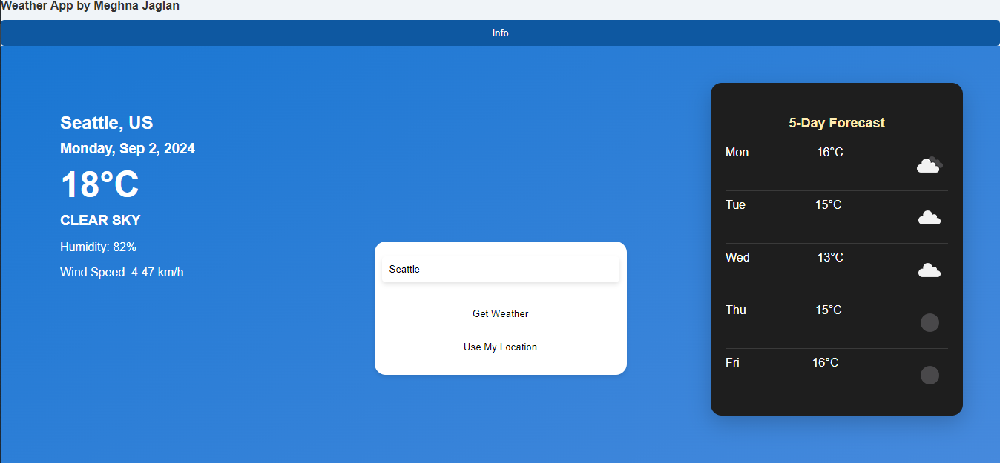

# weather-app 🌦️

Created as part of technical assessment for [PM Accelerator](https://www.linkedin.com/school/productmanagerinterview/about/).
This project is a simple yet dynamic weather application that provides real-time weather updates and a 5-day forecast for any city in the world. It also allows users to get weather updates based on their current location.

The app is built using React for the frontend and Flask for the backend, utilizing the OpenWeatherMap API for fetching weather data.

## Features

- 🌍 **Search Weather by City**: Enter the name of a city to get the current weather and a 5-day forecast.
- 📍 **Get Weather by Location**: Click "Use My Location" to get the weather for your current location using the browser's geolocation API.
- 📅 **5-Day Forecast**: Provides a 5-day weather forecast with detailed weather icons.

## Demo



[Weather App video demo link](https://youtu.be/aF8RM-CJCz0)

## Tech Stack

- **Frontend**: React, Axios, CSS
- **Backend**: Flask, Python
- **API**: [OpenWeatherMap API](https://openweathermap.org/api)

## Installation

To run this project locally, follow these steps:

### Prerequisites

- Node.js and npm installed
- Python and pip installed

### Clone the Repository

```bash
git clone https://github.com/yourusername/weather-app.git
cd weather-app
```

### Backend Setup

1. Navigate to the `backend` directory:

```bash
cd weather-app/backend
```
2. Create and activate a virtual environment:

```bash
python -m venv venv
.\venv\Scripts\activate   # On MAC, use `source venv/bin/activate`
```
3. Install the required dependencies using `requirements.txt`:


```bash
pip install -r requirements.txt
```
4. Create a `config.json` file in the `backend` directory and add your OpenWeatherMap API key.
```json
{
  "OPENWEATHERMAP_API_KEY": "your_api_key_here"
}
```
5. Run the Flask server:
```bash
python app.py
```

### Frontend Setup

1. Navigate to the ``frontend`` directory:

```bash
cd weather-app/frontend
```
2. Install the required dependencies:

```bash
npm install
```
3. Start the React development server:

```bash
npm start
```
4. Open your browser and go to `http://localhost:3000` to see the app in action.

## License

This project is open source and available under the [MIT License](LICENSE).

## Acknowledgements

-   [OpenWeatherMap API](https://openweathermap.org/api) for providing the weather data.
